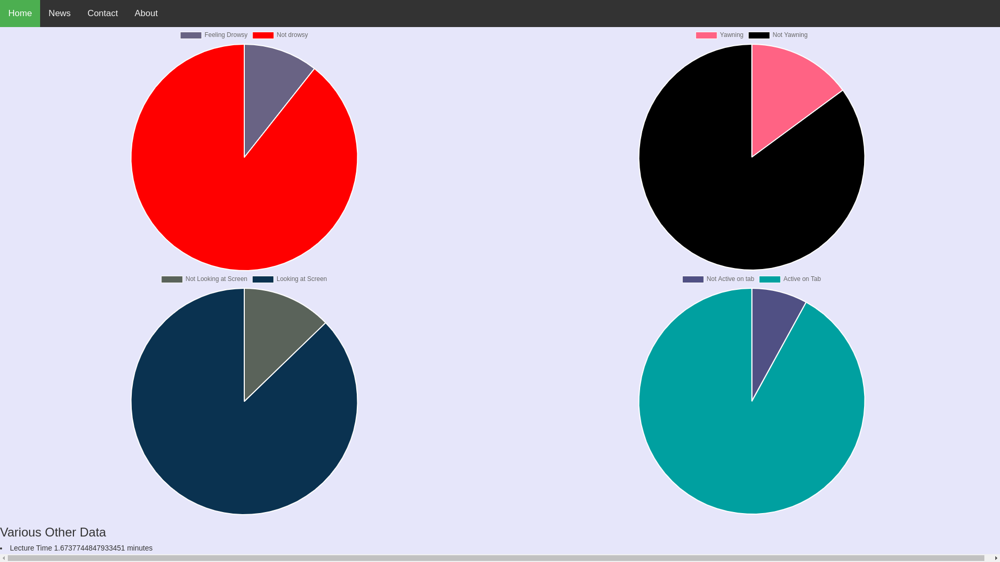
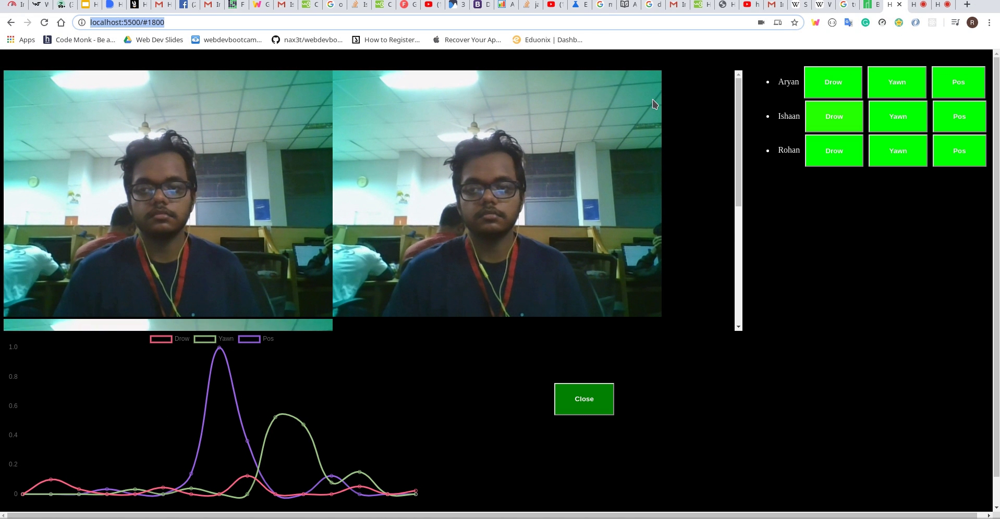

# Hack36-HackO'holics

# E-TUTELAGE

Our Project revolves around the "Smart Education" theme of Hack36. It aims at improving the quality of E-education over a local network, through one-to-many Video communication, i.e., techer-to-students live classes in a local college or university network. We are making it more analysis-oriented by using in it technologies like Facial Detection using Deep Learning, real-time Feedback using Charts and Alert systems, etc. We are also creating a summary at the end of the video lecture, both for the teacher's and the students' sides. At the end of the session, based on the data received by the ML Model, we can show the general attentiveness of all the students in the class to the teacher, highlighting the durations of the lecture where the students felt the most boredom or where most students had doubts, giving the lecturer an analysis on his/her performance and helping him in furtehr improving the course. On the Students' side, he/she would receive the feedback about his/her own concentration for the whole duration. Besides these features, the students and teachers, both would have a dashboard - where their past performance would be stored and also, they can add a to-do list for them to finsih for a particular day.

# Abstract

Monitoring a student while they are in a video conferencing classroom is a non-intrusive approach to digitizing students' behaviour. Understanding students' attention span and what type of behaviours may indicate a lack of attention is fundamental for understanding and consequently improving the dynamics of a lecture. The main goal of this project is to develop an autonomous agent able to provide information to both teachers and students. Student engagement is positively linked to desirable academic outcomes, such as critical thinking, and grades obtained in the subject.
Features and Pose Extraction: One immediate feature that comes to mind is eye tracking but eye tracking tends to suffer from low resolution images. Hence we use head position which tends to contribute highly in the overall gaze direction.
Although head position already is highly accurate in attention detection, paired with another technique vastly improves the results.
Students that are paying attention normally react to stimulus the same way, that is students having their motions synchronised to the majority are paying attention. An example of this synchronization is when the class has to bend down to write when the teachers instructs them to.
This project can revolutionalize education by providing guidance and feedback not only to the teachers on how to improve their teaching, as well as to the students on how to improve their behaviour and their academic performance. Our project provides visual feedback to the teachers regarding the average level of students’ attention, and provide counseling to the students regarding their behaviour during the class. For example, we can sessions in which students were less watchful and the corresponding topics that potentially need extra attention.

## Getting Started

```
git clone https://github.com/IshaanG/hack36-hackoholics.git
cd hack36-hackoholics
python server.py &
cd api_server
python serverf.py &
```
Thats it now you can see the website running at http://localhost:5500

### Prerequisites

Just run
```
python requirements.txt
```
and you are ready for using our project


## Running the tests

Here, we will explain how to run the tests for this system.


## Deployment

We will be adding additional notes about how to deploy this on a live system.


## Built With
* [HTML5](*)
* [SASS](*)
* [JS](*)
* [Flask](*)
* [Open CV](*)
* [Dlib](*)
* [Web RTC](*)
* [Flutter](*)


## Authors and Contributors

* **Ishaan Gupta** - *Initial work and DL Model* - [IshaanG](https://github.com/IshaanG)
* **Aryan Khandelwal** - *Backend* - [aryan29](https://github.com/aryan29)
* **Rohan Nishant** - *Frontend* - [rondon1947](https://github.com/rondon1947)


## Acknowledgments

* We would like to thank each and everyone, who had even the smallest of contributions to our project.

## Snapshots of our Project



